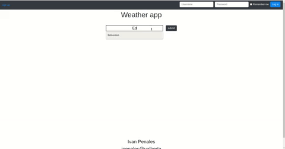
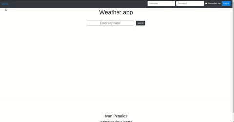
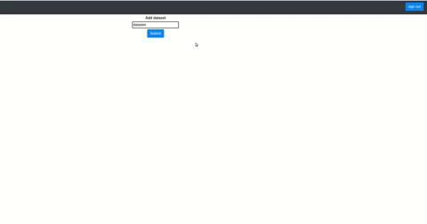

# Weather-app
This is a web app that gets realtime weather data and displays it to the user. The user can create an account. Within their account the user can create a dataset 
and in this dataset the user can add snapshots of weather data from various cities.
## Querying the app for weather data
  - 
## signing up
  - 
## Adding datasets and cities to datasets
  - 
